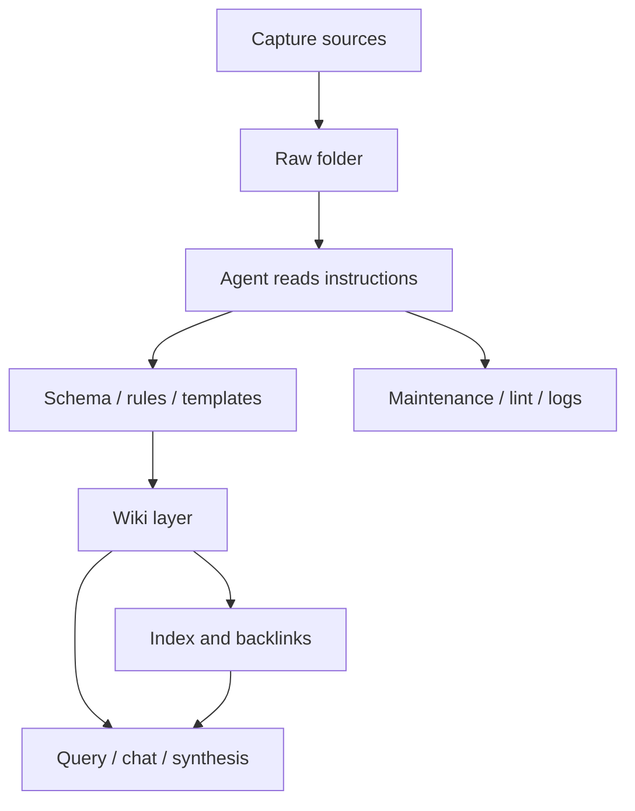

## Second Brain with Obsidian and Agentic AI

This note summarizes the shared architecture that emerges across the three clippings:
1. [[Andrej Karpathy Just 10x’d Everyone’s Claude Code]]
2. [[How I Use Obsidian + Claude Cowork to Run My Life]]
3. [[How To Build LLM Wiki In Obsidian? 🧠 A Memory Layer For Any Agentic AI]].

## Core idea

The system is a local **markdown** knowledge base that an agent can read, update, and query. Obsidian is the human-facing interface, but the real contract is the folder structure, frontmatter, and instructions that tell the agent how to move information from raw capture into structured knowledge.

The architecture is intentionally simple:

- **raw** source material stays untouched
- an agent extracts and reorganizes the source into a wiki layer
- schema files define the rules for names, metadata, and workflows
- index files provide navigation and fast lookup
- **logs** or **maintenance** files record what changed and why
- optional skills and scripts make the process repeatable

## Layered architecture

### 1. Capture layer

This is where articles, transcripts, meeting notes, PDFs, and other source material land first. The source is preserved as-is so the system always has a faithful record to return to.

### 2. Instruction layer

The agent needs a small set of control files that explain how the vault works. Across the clips, these appear as `Claude.md`, `me.md`, vault maps, skill maps, `agents.md`, and folder-specific schema docs. Their job is to tell the model where to look, what to edit, and what not to touch.

### 3. Schema and template layer

This layer defines the shape of the knowledge. It includes naming conventions, frontmatter fields, note templates, and accepted tags or note types. The goal is consistency, so every generated note looks and behaves the same way.

### 4. Wiki layer

This is the curated knowledge layer. The agent turns raw input into linked notes, concepts, entities, projects, or topic pages. The wiki is where relationships become explicit through wikilinks and cross-references.

### 5. Index and retrieval layer

Indexes and domain sub-indexes let the agent move through a large vault without reading everything. This is the main alternative to embedding-heavy RAG in these systems: the model follows structure and links rather than only similarity search.

### 6. Maintenance layer

Linting, validation, logging, and periodic cleanup keep the vault healthy. The maintenance pass checks frontmatter, missing links, stale notes, duplicate concepts, and gaps that need more source material.

## Practical operating model

1. Put new content into `raw`.
2. Tell the agent to ingest it.
3. Let the agent extract concepts, entities, summaries, and connections.
4. Update indexes and logs.
5. Run lint or maintenance to verify the vault is still coherent.
6. Query the wiki through Obsidian or another agent when you need synthesis.

## Two variants of the same pattern

The clips describe two closely related uses:

- a research or media wiki, where raw transcripts and articles become a topic graph
- a personal second brain, where notes about life, work, and projects become an agent-readable memory layer

The first is optimized for ingestion at scale. The second is optimized for continuity, planning, and ongoing personal context.

## Why this works

This architecture works because it gives the model a stable environment instead of forcing it to infer structure from a giant unorganized vault. The model does less guessing, the human keeps ownership of the files, and the system compounds over time instead of resetting every chat.

## Source notes

- [[Andrej Karpathy Just 10x’d Everyone’s Claude Code]]
- [[How I Use Obsidian + Claude Cowork to Run My Life]]
- [[How To Build LLM Wiki In Obsidian? 🧠 A Memory Layer For Any Agentic AI]]
- [[How the Open Knowledge Format can improve data sharing]]

## Short version

Obsidian is the shell
markdown is the storage format
the schema is the contract
the agent is the worker
the wiki is the memory layer.
